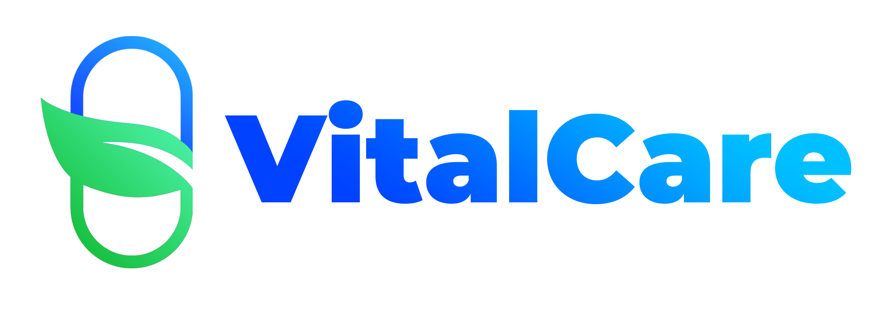

<div align="center">
  
</div>

<div align="center">
<p><i>Thuốc tốt, khỏe ngay - VitalCare trong tay</i></p>
</div>

## Giới thiệu

Trong bối cảnh hiện đại, việc quản lý và bán dược phẩm, thiết bị y tế là một trong những
lĩnh vực quan trọng không chỉ đảm bảo chất lượng sản phẩm mà còn ảnh hưởng trực
tiếp đến sức khỏe cộng đồng. Tuy nhiên, ở một số cửa hàng thuốc truyền thống, việc
quản lý thông tin sản phẩm, theo dõi doanh thu, và kiểm tra hạn sử dụng thường được
thực hiện thủ công, dẫn đến một số hạn chế còn tồn đọng.

Với mong muốn giải quyết các hạn chế đó, nhóm lựa chọn đề tài **Xây dựng website quản lý bán dược phẩm, thiết bị y tế cho các cửa hàng thuốc** cho môn Interner và Công nghệ Web (IE104). Đề tài không chỉ có tính thực tiễn mà còn là cơ hội để học hỏi và nâng cao năng lực chuyên môn đối với các thành viên trong nhóm.

## Demo (đang bổ sung)

## Cấu trúc thư mục

```
medicine-sales-website/
    ├── backend/ # NodeJS + ExpressJS
    │ ├── env/
    │ ├── spec/
    │ ├── src/
    │ ├── Dockerfile
    │ ├── .eslintignore
    │ ├── .prettierignore
    │ ├── .prettierrc.yml
    ├── frontend/ # ReactJS + TailwindCSS
    │ ├── public/
    │ ├── src/
    │ ├── .env
    │ ├── .gitignore
    │ ├── Dockerfile
    │ ├── package.json
    │ ├── README.md
    │ ├── tailwind.config.js
    │ ├── vite.config.js
    ├── docs/
    ├── docker-compose.yml
    └── README.md
```

## Cách chạy dự án

Bạn có thể chạy dự án theo một trong hai cách sau: sử dụng Docker hoặc tự cài đặt dependencies

### Nếu sử dụng Docker

Để chạy dự án bằng Docker, trước hết phải đảm bảo rằng bạn đã có Docker trên máy của,mình. Sau đó, bạn chạy các lệnh sau đây:

1. Clone dự án từ GitHub:

```bash
git clone https://github.com/yourusername/medicine-sales-website.git
```

2. Di chuyển vào thư mục dự án:

```bash
cd medicine-sales-website
```

3. Pull image từ DockerHub:

```bash
docker compose pull
```

4. Chạy với Docker Compose:

```bash
docker compose up
```

### Nếu cài đặt thủ công

Để cài đặt thủ công, hãy đảm bảo có `npm >= 9.2`. Sau đó, bạn chạy các lệnh sau đây:

1. Clone dự án từ GitHub:

```bash
git clone https://github.com/yourusername/medicine-sales-website.git
```

2. Di chuyển vào thư mục dự án:

```bash
cd medicine-sales-website
```

3. Cài đặt dependencies và khởi chạy service ở backend/

```bash
cd backend/
npm install
npm run dev
cd ..
```

4. Cài đặt dependencies ở frontend/

```bash
cd frontend/
npm install
npm run dev
cd ..
```

## Deployment

- Frontend: https://medicine-vitalcare.vercel.app/
- Backend: https://medicine-vitalcare-backend.up.railway.app/api-docs/
- Database: Deployed MySQL on Aiven 

